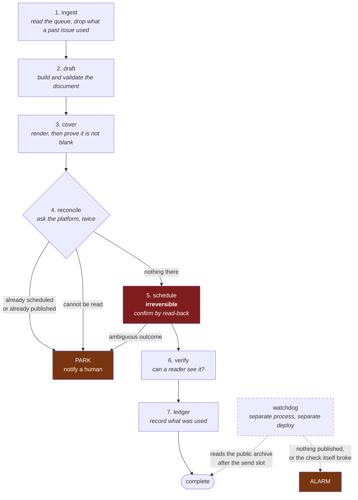

# newsletter-autopilot

A daily newsletter that drafts itself, renders its own cover, schedules itself,
verifies that a reader can actually see it, and refuses to send twice. Plus an
independent watchdog that notices a silent miss the same morning.

Clone it and run the whole pipeline against a mock platform in one command. No
credentials, no account, nothing emailed.

```bash
git clone <this repo> && cd newsletter-autopilot
python3 -m pytest -q
PYTHONPATH=src python3 -m newsletter_autopilot.cli \
  --config examples/policy.toml \
  dry-run --stories examples/sample-stories.json --date 2026-09-02
```

```
DRY_RUN: would schedule 'Example Daily, 2026-09-02' for 2026-09-02 09:00 EDT
stages completed: ingest -> draft -> cover -> reconcile
```

Drop `dry-run` for `publish` and it runs all seven stages against the bundled
mock publisher, writing a real cover PNG, a real draft, and a real dedup ledger
to `.autopilot/`.

---

## Why this is interesting

Publishing a newsletter is easy. Publishing one **unattended, every weekday, at
most once, forever** is not. The hard part is not the happy path, it is the set
of states where the honest answer is "I do not know whether that send landed",
and where guessing wrong emails a real subscriber list twice.

This repo is the distilled engine of a production system that has been shipping a
daily issue on a weekday schedule, and the three ideas worth reading are:

| | |
|---|---|
| **[At-most-once publishing](docs/patterns/at-most-once-publishing.md)** | Ambiguous is a third outcome, not a kind of failure. It parks the run and asks a human, because a timeout on the one irreversible call is precisely when a retry sends twice. |
| **[Lock asymmetry](docs/patterns/lock-asymmetry.md)** | Stealing a live lock is irrecoverable; holding a dead one is a notification. So every uncertain answer resolves toward "the holder is alive", and age is never treated as proof of death. |
| **[The independent watchdog](docs/patterns/independent-watchdog.md)** | The check lives outside the thing it checks, imports nothing from it, and asks whether readers got an issue, not whether the job ran. |

There is also a [case study on integrating against an undocumented publishing
API](docs/case-study-undocumented-api.md) recovered from a product's own
frontend, and on the conditions that had to be true before that integration was
allowed near a real list.

---

## The pipeline



Stages 1 to 4 are reads and local work. **Everything that can reject a run
happens there**, so a malformed story queue, a missing image, an em dash the
house style forbids, or a blank cover costs zero contact with the platform.

Stage 5 is the only irreversible one, and it is wrapped:

```
exclusive lock, keyed to the ISSUE DATE (not the invocation)
  state already past 'scheduled'  -> no-op, exit 0
  state parked                    -> refuse; a human decides
  inside the cutoff window        -> park, notify, contact nothing
  reconcile scheduled AND published for this date -> park if either exists
  write the phase BEFORE the call, confirm by read-back AFTER
  ambiguous outcome               -> park, never retry
```

After the schedule lands, **nothing can fail the run**. Later problems are
reported as "it IS scheduled, and then this broke", never as "the run failed, try
again", because at that point trying again is how you get two issues.

## The safety properties, and the test that pins each one

| property | test |
|---|---|
| A second run for the same issue is a no-op | `test_a_second_run_for_the_same_issue_is_a_no_op` |
| Deleting all local state still cannot double-send | `test_a_fresh_state_dir_still_cannot_double_send` |
| An issue that already went out blocks a new one | `test_an_already_published_issue_blocks_a_second_one` |
| An unreadable reconcile parks instead of creating | `test_an_unreadable_reconcile_parks_rather_than_creating` |
| An ambiguous schedule parks and never retries | `test_an_ambiguous_schedule_parks_and_never_retries` |
| A park that followed a remote call cannot be unparked | `test_a_park_that_followed_a_remote_call_cannot_be_unparked` |
| A 200-that-did-nothing is caught by read-back | `test_a_silent_no_op_write_is_caught_by_read_back` |
| The cutoff parks without contacting anything | `test_the_cutoff_parks_without_contacting_anything` |
| Recovery still releases by scheduling, at most once | `test_recovery_refuses_a_second_release_even_after_the_phase_is_reset` |
| A live lock holder is never reclaimed on age | `test_a_live_holder_is_never_reclaimed_on_age` |
| A recycled pid does not read as alive | `test_a_recycled_pid_does_not_look_alive` |
| A blank cover at correct dimensions is caught | `test_a_blank_render_is_caught_even_at_correct_dimensions` |
| A broken watchdog never reads as all clear | `test_a_broken_check_alarms_and_never_reads_as_all_clear` |
| An unreadable scheduled list parks, even on a plain failure | `test_an_unreadable_scheduled_list_parks_on_a_plain_failure_too` |
| An unexpected internal error still notifies a human | `test_an_unexpected_internal_error_still_notifies` |
| A bare `save()` never erases a concurrent recovery marker | `test_a_bare_save_never_erases_a_concurrent_recovery_marker` |
| A dry run never parks the real issue | `test_a_dry_run_never_parks_the_real_issue` |
| `cancel` refuses while a run holds the lock | `test_cancel_refuses_while_a_run_holds_the_lock` |
| The failure message admits when a draft exists | `test_the_failure_message_admits_a_draft_exists` |
| Losing the lock-reclaim race yields instead of stealing | `test_losing_the_reclaim_race_reports_contention_not_a_disk_fault` |
| The adapter contract exposes no immediate-publish member | `test_the_contract_has_no_immediate_publish_member` |
| The gate measures the encoded PNG, not the buffer | `test_the_gate_measures_the_encoded_bytes_not_the_buffer` |
| An unrelated same-day post cannot mask a missed issue | `test_an_unrelated_post_today_does_not_mask_a_missed_issue` |
| An evening send is still today after UTC conversion | `test_an_evening_send_is_still_today_after_the_utc_conversion` |

`python3 -m pytest -q` runs all 82.

## Design decisions you can see in the code

**Platform-agnostic by construction.** The pipeline imports
`adapters.base.PublisherAdapter` and never a concrete client. Adding Ghost,
Buttondown, Beehiiv, or an internal ESP is a new file plus a registry entry. The bundled `MockPublisher` is not a stub: it reproduces the behaviours
that make real newsletter APIs dangerous, and you can inject them:

```python
MockPublisher(root, ambiguous_on={"schedule"})     # a timeout on the send
MockPublisher(root, silent_no_op_on={"set_cover"}) # 200 OK, wrote nothing
MockPublisher(root, empty_list_lie=True)           # a reconcile you must not trust
```

**The `PublisherAdapter` contract exposes no immediate-publish call.** The only
way an issue goes out is the platform firing a schedule that this code set and
confirmed, and even the same-day recovery releases by scheduling minutes out.
"Just send it now" is not a state the pipeline can reach, for a human or for an
agent. The test enumerates the protocol's members and greps the adapter package
rather than asserting one guessed method name, because a check that names the
method it is looking for would pass on the adapter it is meant to catch. The
mock does own a `_simulate_platform_firing` helper standing in for the
platform's own scheduler; it is off the contract, and a test asserts the
pipeline never calls it.

**Operational policy is data.** The send slot, publishing days, cutoff margin,
recovery ceiling, lock staleness, and issue shape all live in
[`examples/policy.toml`](examples/policy.toml). Changing when the newsletter goes
out never means editing the code that emails people.

**Renders are checked on their output.** A green exit code, a file on disk, and
correct dimensions are not proof an image looks right, because a blank render
passes all three. Every cover is **decoded back out of the encoded PNG** and
then measured, so an encoder that writes an empty file at the right dimensions
is caught too. The measurement is ink coverage **in the interior**, against the
interior's own dominant colour: a decorated border around an empty middle fails,
and so does a frame whose top-left pixel happens to sit on a stripe.

**The failure messages are the product.** Three outcomes, deliberately different:
`scheduled`, `failed` ("nothing was created, safe to fix and re-run"), and
`scheduled_but_incomplete` ("it IS going out, do NOT re-run, fix this by hand").
Notify first and persist state second, because a handler that writes to disk
before sending will, on a disk failure, raise and tell nobody, on exactly the
path where the email may already be scheduled.

## Layout

```
src/newsletter_autopilot/
  pipeline.py      the seven stages and the guard around the irreversible one
  state.py         durable per-issue run state, phases, park/unpark
  locking.py       the lock asymmetry
  ledger.py        append-only dedup ledgers, idempotent by date
  issue.py         ingest, draft, and every check that costs zero remote calls
  cover.py         a dependency-free renderer and the visual render gate
  notify.py        three honest outcomes, swappable channels
  config.py        policy as data
  adapters/        the platform interface, and a mock that misbehaves usefully
watchdog/
  outcome_check.py standalone, stdlib only, imports nothing from the pipeline
docs/              the patterns and the API case study
tests/             82 tests, no network, no credentials
```

Python 3.11+, **zero runtime dependencies**. `pytest` for the tests.

---

## Distilled vs illustrative

This repo is a rebuild, not an export. Being precise about which is which:

**Distilled from production** (the design and its reasoning came from a live
system, the code here is a clean-room rewrite around it):

- the at-most-once state machine, its phase ordering, and park-never-retry
- the lock asymmetry, including pid-plus-start-time identity and the
  omit-rather-than-empty rule
- reconcile asking both "scheduled" and "published", and treating an unreadable
  answer as ambiguous
- the content seal before the schedule, and read-back confirmation generally
- the two-half at-most-once recovery marker, and the reason the recovery command
  exists at all
- the append-only dedup ledger, its atomic whole-file replace, and why it is code
  instead of a checklist item
- the three-outcome failure vocabulary, including refusing to say "nothing was
  created" on a path where a draft exists
- the watchdog's independence, its three exit codes, and the UTC-to-local
  conversion
- the three-outcome notification vocabulary and notify-before-persist

**Illustrative, written for this repo** (a real deployment replaces these):

- `MockPublisher`. There is no live platform client here at all.
- the dependency-free cover renderer. The **gate** is the distilled part; the
  bitmap-font renderer exists so the repo runs with nothing installed.
- ingest reads a JSON file. Production read a queue in a database.
- drafting assembles blocks mechanically. Production had an editorial step.
- the sample stories, the example policy, and the publication name are invented.

**Deliberately not here**: any credential, cookie, token, or keychain reference;
the production route table for the platform in the case study; and any real
publication, subscriber, or account identifier. The case study describes the
method and quotes a couple of routes as illustration of shape, nothing more.

## License

MIT. See [LICENSE](LICENSE).
